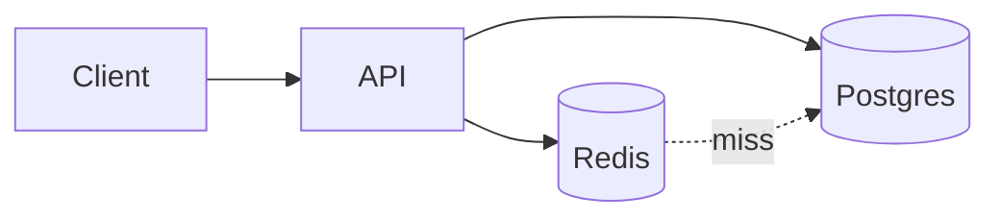

<!-- layout: center -->
^ ${event}
# Caching without tears
How we cut API latency by 70%. ${speaker}

---

## The problem

:::stats style=big
- 900 ms | p99 latency
- 40% | Requests that hit the DB twice
:::

Note: Ask the room who has seen numbers like this.

---

## The architecture



---

## Read-through cache

```ts cache.ts {1|2-3|4-6}
export async function getUser(id: string) {
  const hit = await redis.get("user:" + id);
  if (hit) return JSON.parse(hit);
  const user = await db.user.find(id);
  await redis.set("user:" + id, JSON.stringify(user), "EX", 300);
  return user;
}
```

Note: Step through: lookup, hit path, then miss path and write-back.

---

## Gotchas

> [!WARNING] Invalidate on write, or users will see stale data for up to 5 minutes.

- Stampedes when a hot key expires
- Cache keys that change between releases
- Caching errors by accident

---

## Results

:::chart style=column ms
- Before | 900
- Week 1 | 420
- Week 4 | 270
:::

---

## Takeaways

:::cards style=numbered cols=3
- check | Measure first | Find the hot paths
- check | Cache reads | Invalidate on writes
- check | Watch hit rate | Alert when it drops
:::

---

<!-- layout: center -->
# Thank you
Slides and code: github.com/your-name/caching-talk
