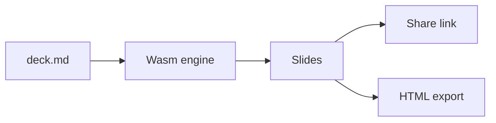

<!-- layout: center -->
^ md2slides
# Write Markdown. Present like a designer...
One .md file is one deck, versioned in Git.

---

## Everything is a block

:::cards style=glass cols=3
- lightning | Live preview | Every keystroke re-renders the deck
- squares-four | Components | Drag slides and blocks to reorder
- share-network | Share links | The deck travels inside the link
:::

---

## Numbers that matter

:::stats style=big
- 0 | Servers needed to share
- 1 | Markdown file per deck
- 60 | Blocks and templates
:::

---

## Diagrams from text



---

## Code that walks itself

```ts deck.ts {2|3}
const deck = await parse("deck.md");
const link = await share(deck, { expires: "7d" });
present(deck, { from: 1 });
```

---

## Ship it

:::timeline style=h
- Write | Markdown in your repo
- Style | Themes, layouts, motion
- Share | A link or one HTML file
:::

> [!TIP] Open any deck in VS Code with the md2slides extension.
