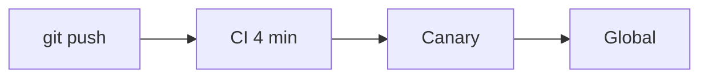

<!-- layout: center -->
^ Client update
# Q3 platform review
What we shipped for Acme Corp

---

## Results

:::stats style=big
- 4 min | CI time, was 38
- 0 | Incidents in 90 days
- 12 | Releases per week
:::

---

## How a deploy flows

---

## Next quarter

:::cards style=glass cols=3
- rocket | Multi-region | Active-active in EU + US
- shield-check | SOC 2 | Audit in November
- gauge | p99 < 100ms | Edge caching
:::
